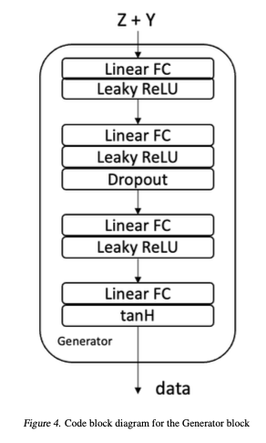
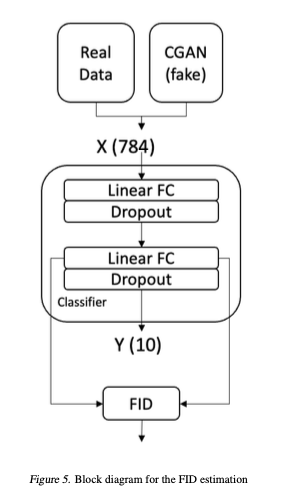

# Conditional GANs on MNIST

Final Project for ECE 50024 - Machine Learning

## Description

An implementation of Conditional Generative Adversarial Networks for generating MNIST-type digits. Generative Adversarial Networks leverage an adversarial architecture to train a generative model. Conditional GAN extends this idea to condition the generator with extra parameters (usually labels) to generate specific distribution of outputs. This implementation is pretty barebones, using just MLPs for both networks. This implementation also contains a simple FID estimator based on a basic MNIST classifier. This FID was used to quantify the quality of outputs and perform ablation/sensitivity against some hyperparameters.

## Contents:

1. CGAN - Contains the C-GAN architecture and training code
2. MNISTClassifer - A basic MNIST classifer whose activations are used as FID feature space.
3. FID - The FID implementation used to quantify CGAN output quality
4. SensitivityAnalysis - Hyper-parameters vs FID

## Architecture:

1. Generator Structure:

2. Discriminator Struture:

3. FID Structure:

4. Results:
---
Epoch 10:

Epoch 50:

Epoch 100:

